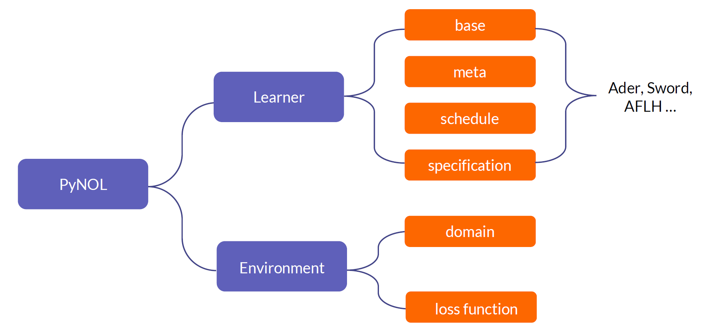
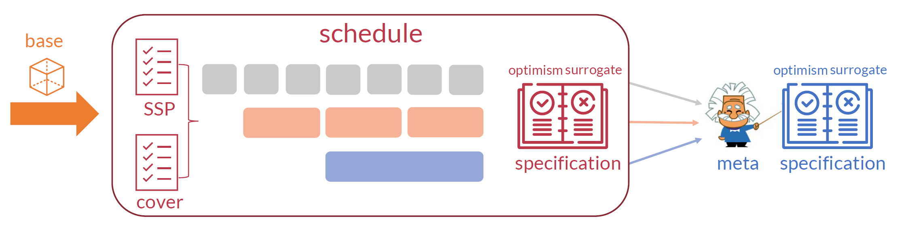
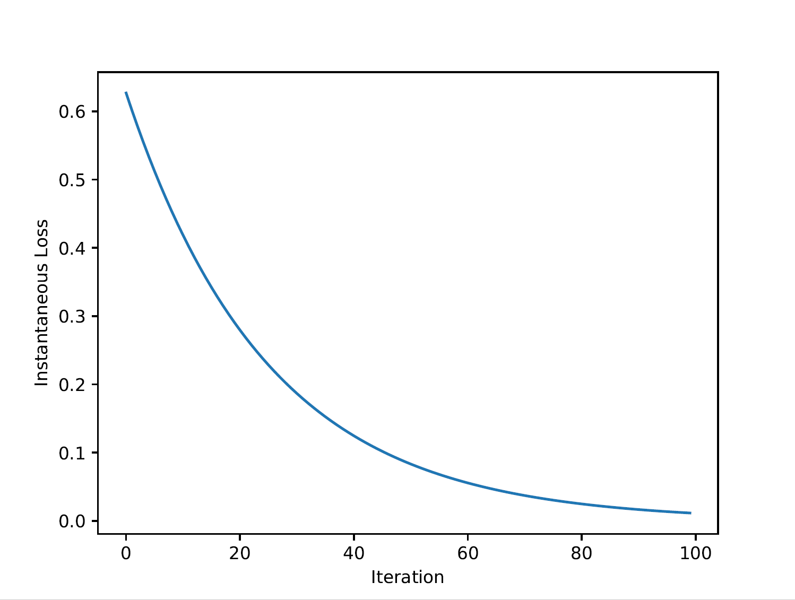
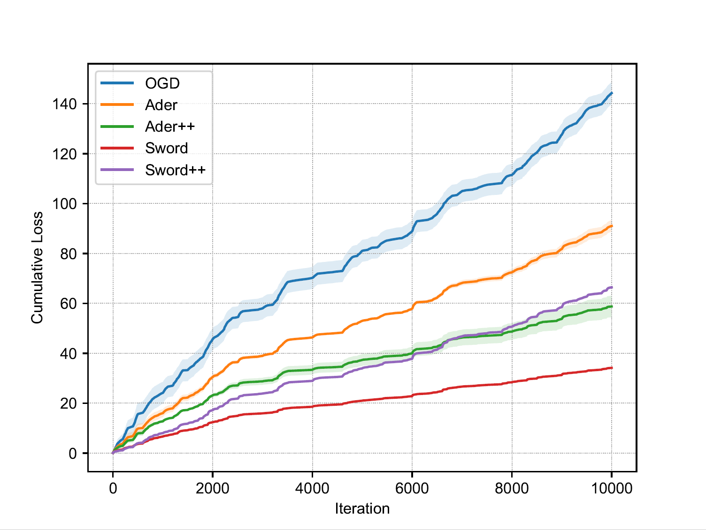
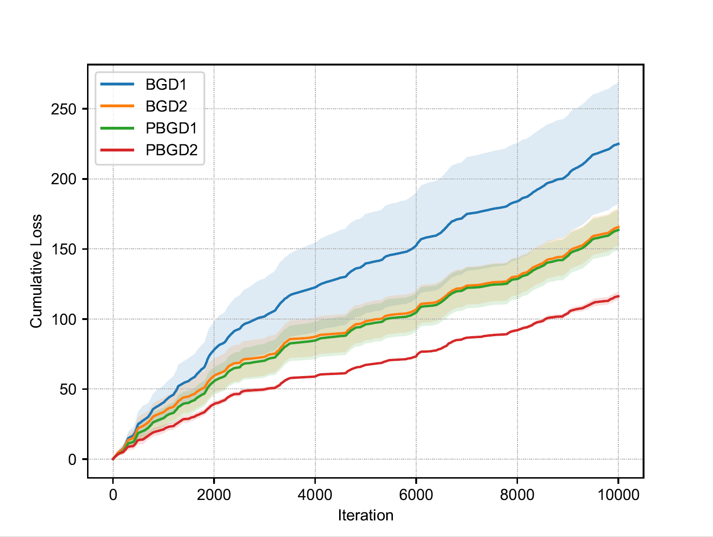
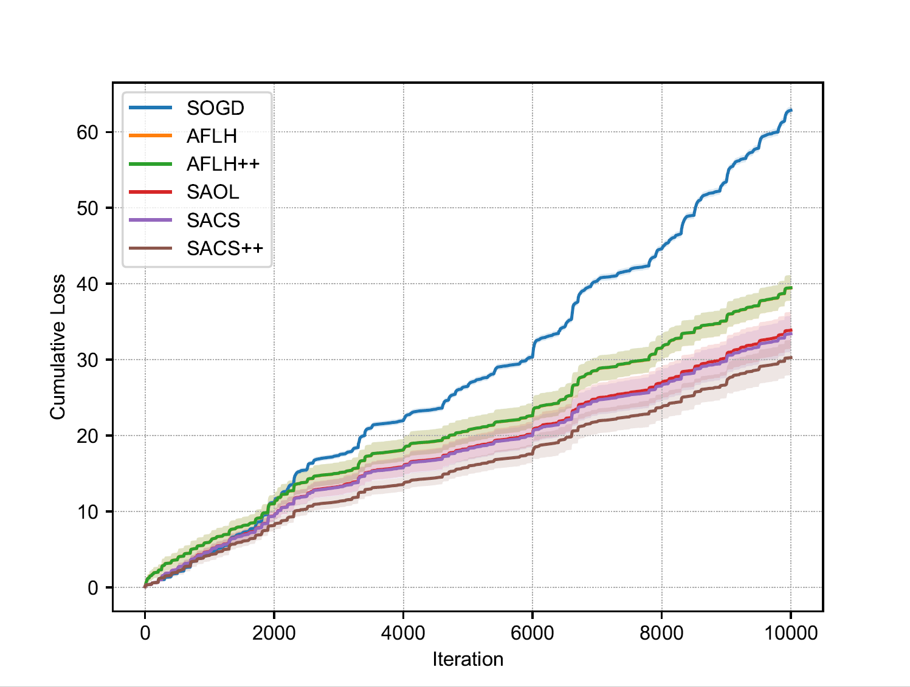

# PyNOL

[](https://github.com/li-lf/pynol/blob/main/LICENSE) [](https://pypi.org/project/pynol/) [](https://pynol.readthedocs.io/en/latest)

PyNOL is a **Py**thon package for **N**on-stationary **O**nline **L**earning. 

The purpose of this package is to provide a general framework to implement various algorithms designed for online learning in non-stationary environments. In particular, we pay special attention to those online algorithms that provably optimize the *dynamic regret* or *adaptive regret*, two widely used performance metrics for non-stationary online learning.

There are various algorithms devised to optimize the measures (dynamic regret or adaptive regret) during the decades, see [2, 9, 12, 21, 23, 24, 25, 27] for dynamic regret and [7, 11, 13, 20, 22] for adaptive regret. By providing a unified view to understand many algorithms proposed in the literature, we argue that there are three critical algorithmic components: **base-learner**, **meta-learner**, and **schedule**. With such a perspective, we present systematic and modular Python implementations for many online algorithms, packed in PyNOL. The package is highly flexible and extensible, based on which one can define and implement her own algorithms flexibly and conveniently. For example, we also implement some classical algorithms for online MDPs based on this package [4, 18, 24, 29].

## Document

The tutorials and API documentation are hosted on [pynol.readthedocs.io](https://pynol.readthedocs.io/).

## Installation

PyNOL is currently hosted on [PyPI](https://pypi.org/project/pynol/). It requires Python >= 3.8. You can simply install PyNOL from PyPI with the following command:

```bash
$ pip install pynol
```

To use PyNOL by source code, download this repository and run the following command:

```bash
$ python setup.py build
$ python setup.py install
```

## Structure

Since OCO can be viewed as a repeat game between a learner and environments, PyNOL follows this structure and thus consists of two parts logically: `learner` and `environment`.

- `learner`: this module defines the strategy employed by the online learner, and one can use our predefined models such as `OGD`, `Sword`, `SAOL` and so on, or define own model by flexibly combining the modules in `base`, `meta`, `schedule` and `specification`, which will be introduced in detail later.
- `environment`: this module consists of `domain` and `loss function`. Before the game starts, the environment chooses the feasible set $\mathcal{X}$ by `domain` and passes to the`learner`. And at each iteration $t$,  the learner choose a decision $x_t\in \mathcal{X}$ in the `domain` and simultaneously the environment reveals loss function $f_t$ by `loss function`.


 The overall structure of PyNOL looks like:
<div align=center>

</div>


Firstly, we introduce the `learner` part in details. As mentioned earlier, we present a unified view to understand many existing learning algorithms for dynamic regret or adaptive regret minimization. As a result, the `learner` component includes `base`, `meta`, `schedule`, and `specification`.

- `base`: this module implements the base-learner, a particular online algorithm that can achieve low regret given a specific path-length (for dynamic regret) or a specific interval (for adaptive regret). We implement online gradient descent (OGD) [30], bandit gradient descent (BGD) with one-point feedback [8] and two-point feedback [1], online extra-gradient descent (OEGD) [6], optimistic online gradient descent (Optimistic OGD) [17] and scale-free online gradient descent (SOGD) [16].
- `meta`: this module implements the meta-learner, used to combine intermediate decisions from base learners. PyNOL includes Hedge [14], Optimistic Hedge [17], MSMWC [5], AFLH Meta [10] , Prod [3, 7] and AdaNormalHedge [15].
- `schedule`: this module consists of two parts: `SSP` and `Cover`. `SSP` specifies how to initialize the base-learners, which is important for dynamic algorithms. The dynamic algorithms construct a step size pool (SSP) at first and then initialize multiple base-learners, each employs a specific step size. The construction is based on exponential discretization of possible range of the optimal step size that usually depends on unknown path-length.  `Cover` contains different interval partitions (Cover) that base-learners will last for, such as geometric cover (GC) [7, 10], compact GC (CGC) and its problem-dependent version PCGC [20], which is important for adaptive algorithms.
- `specification`: Besides these three main components, the remaining parts of algorithms are collectively referred to `specification`, which mainly includes the design of `optimism` and `surrogate loss` and so on. As many algorithms can be viewed as specials cases of Optimistic Mirror Descent, the construction of `optimism` is crucial in algorithmic design. Moreover, replacing original loss function by `surrogate loss` is a useful technique which can bring great benefits sometimes.

The overall structure is as follows. Online learner maintains a bunch of base-learners according to some dedicated schedule and then employs the meta-learner to ensemble them all to hedge the uncertainty. With this structure,  PyNOL eases the extension/modification of existing models, as well as the creation of new models by the implemented APIs.

<div align=center>

</div>


Next, we introduce `environment`, which defines the experiment environment by `domain` and `loss function`:

- `domain`: this module defines the feasible set of the learner's decision. In this module, we provide two common feasible sets: Euclidean ball and simplex. Users can define their desired type of feasible set in this module.
- `loss function`: this module defines the loss function revealed by the environment. In this module, one can find common loss functions to use: `logarithmic loss`, `squared loss` and so on. Similarly, users can define more loss functions easily without having to give the form of derivative function since it is computed automatically by `autograd`.

In short, one can define a new model with `base`, `meta`, `schedule`, `specification` and define the experiment environment with `domain`, `loss function` easily and quickly. Combining `learner` and `environment`, user completes the construction of the online learning procedure.

## Implemented Algorithms

<table>
<thead>
  <tr>
    <th colspan="2" rowspan="2">Model</th>
    <th colspan="3">base learner</th>
    <th colspan="3">meta learner</th>
    <th rowspan="2">Schedule</th>
  </tr>
  <tr>
    <th >algorithm</th>
    <th >opt.</th>
    <th >surr.</th>
    <th >algorithm</th>
    <th >opt.</th>
    <th >surr.</th>
  </tr>
</thead>
<tbody>
  <tr>
    <td  rowspan="6">static</td>
    <td >OGD [30]</td>
    <td >OGD</td>
    <td >---</td>
    <td >---</td>
    <td >---</td>
    <td >---</td>
    <td >---</td>
    <td >---</td>
  </tr>
  <tr>
    <td >BGD1 [8]</td>
    <td >BGD1</td>
    <td >---</td>
    <td >---</td>
    <td >---</td>
    <td >---</td>
    <td >---</td>
    <td >---</td>
  </tr>
  <tr>
    <td >BGD2 [1]</td>
    <td >BGD2</td>
    <td >---</td>
    <td >---</td>
    <td >---</td>
    <td >---</td>
    <td >---</td>
    <td >---</td>
  </tr>
  <tr>
    <td >OEGD [6]</td>
    <td >OEGD</td>
    <td >&#10003</td>
    <td >---</td>
    <td >---</td>
    <td >---</td>
    <td >---</td>
    <td >---</td>
  </tr>
  <tr>
    <td >OptimisticOGD [17]</td>
    <td >OptimisticOGD</td>
    <td >&#10003</td>
    <td >---</td>
    <td >---</td>
    <td >---</td>
    <td >---</td>
    <td >---</td>
  </tr>
  <tr>
    <td >SOGD [16]</td>
    <td >SOGD</td>
    <td >---</td>
    <td >---</td>
    <td >---</td>
    <td >---</td>
    <td >---</td>
    <td >---</td>
  </tr>
  <tr>
    <td class="tg-0pky" rowspan="7">dynamic</td>
    <td >Ader [21]</td>
    <td >OGD</td>
    <td >---</td>
    <td >---</td>
    <td >Hedge</td>
    <td >---</td>
    <td >---</td>
    <td >SSP</td>
  </tr>
  <tr>
    <td >Ader++ [21]</td>
    <td >OGD</td>
    <td >---</td>
    <td >&#10003</td>
    <td >Hedge</td>
    <td >---</td>
    <td >&#10003</td>
    <td >SSP</td>
  </tr>
  <tr>
    <td >PBGD1 [25]</td>
    <td >OGD</td>
    <td >---</td>
    <td >&#10003</td>
    <td >Hedge</td>
    <td >---</td>
    <td >&#10003</td>
    <td >SSP</td>
  </tr>
  <tr>
    <td >PBGD2 [25]</td>
    <td >OGD</td>
    <td >---</td>
    <td >&#10003</td>
    <td >Hedge</td>
    <td >---</td>
    <td >&#10003</td>
    <td >SSP</td>
  </tr>
  <tr>
    <td >Sword [27]</td>
    <td >OGD+OEGD</td>
    <td >&#10003</td>
    <td >---</td>
    <td >OptimisticHedge</td>
    <td >&#10003</td>
    <td >&#10003</td>
    <td >SSP</td>
  </tr>
  <tr>
    <td >Sword++ [28]</td>
    <td >OptimisticOGD</td>
    <td >&#10003</td>
    <td >&#10003</td>
    <td >OptimisticHedge</td>
    <td >&#10003</td>
    <td >&#10003</td>
    <td >SSP</td>
  </tr>
  <tr>
    <td >Scream [26]</td>
    <td >OGD</td>
    <td >---</td>
    <td >&#10003</td>
    <td >Hedge</td>
    <td >---</td>
    <td >&#10003</td>
    <td >SSP</td>
  </tr>
  <tr>
    <td class="tg-0pky" rowspan="5">adaptive</td>
    <td >AFLH [10]</td>
    <td >BlackBox</td>
    <td >---</td>
    <td >---</td>
    <td >AFLH Meta</td>
    <td >---</td>
    <td >---</td>
    <td >CGC</td>
  </tr>
  <tr>
    <td >AFLH++ [19]</td>
    <td >BlackBox</td>
    <td >---</td>
    <td >&#10003</td>
    <td >AFLH Meta</td>
    <td >---</td>
    <td >&#10003</td>
    <td >CGC</td>
  </tr>
  <tr>
    <td >SAOL [7]</td>
    <td >BlackBox</td>
    <td >---</td>
    <td >---</td>
    <td >Prod</td>
    <td >---</td>
    <td >---</td>
    <td >GC</td>
  </tr>
  <tr>
    <td >SACS [20]</td>
    <td >SOGD</td>
    <td >---</td>
    <td >---</td>
    <td >AdaNormalHedge</td>
    <td >---</td>
    <td >---</td>
    <td >CGC</td>
  </tr>
  <tr>
    <td >PSACS [20]</td>
    <td >SOGD</td>
    <td >---</td>
    <td >---</td>
    <td >AdaNormalHedge</td>
    <td >---</td>
    <td >---</td>
    <td >PCGC</td>
  </tr>
</tbody>
</table>


Note: One can combine `base`, `meta`, `schedule`, `specification` freely to define more algorithms!

## Examples

### 1. A quick start.

First, we give a simple example that employs Online Gradient Descent (OGD) algorithm to optimize the fixed online loss functions $f_t(x) = {\sum}_{i=1}^d x_i^2, \forall t \in [T]$, where $d$ is the dimension and $T$ is the number of rounds.

```python
import matplotlib.pyplot as plt
import numpy as np
from pynol.environment.environment import Environment
from pynol.environment.domain import Ball
from pynol.learner.base import OGD

T, dimension, step_size, seed = 100, 10, 0.01, 0
domain = Ball(dimension=dimension, radius=1.)  # define the unit ball as the feasible set
ogd = OGD(domain=domain, step_size=step_size, seed=seed)
env = Environment(func=lambda x: (x**2).sum())
loss = np.zeros(T)
for t in range(T):
    _, loss[t], _ = ogd.opt(env)
plt.plot(loss)
plt.savefig('quick_start.pdf')
```

Then, we can visualize the instantaneous loss of the online learning process as follows.

<div align=center>

</div>

### 2. Use predefined algorithms.

Then, we embark on a tour of PyNOL exemplifying online linear regression with square loss. The data $(\varphi_t, y_t)_{t=1,\cdots,T}$ are generated by model parameters   $x_t^* \in \mathcal{X} $ with label  $y_t = \varphi_t^\top {x}_t^* + \epsilon_t $, where feature  $\varphi_t $ and model parameter  $x_t^* $ are are sampled randomly and uniformly in the  $d $-dimension unit ball,  $\varepsilon_t \sim \mathcal{N} (\mu, \sigma) $ is the Gaussian noise. To simulate the non-stationary environments, we generate a piecewise-stationary process with  $S $ stages, where  $x_t^* $ is fixed at each stage and changes randomly among different stages. At iteration  $t $, the learner receives feature  $\varphi_t $, then predicts  $\hat{y}_t = \varphi_t^\top x_t $ according to the current model  $x_t \in \mathcal{X} $. We choose square loss  $\ell(y, \hat{y})=\frac{\alpha}{2}(y-\hat{y})^2 $, so online function  $f_t: \mathcal{X} \mapsto \mathbb{R} $ is the composition of loss function and data item, i.e., $f_t(x) = \ell(y_t, \hat{y}_t)=\frac{a}{2}(y_t-\varphi_t^\top x)^2 $. We set  $T=10000 $,  $d=3 $,  $S=100 $,  $\mu=0 $,  $\sigma=0.05 $ and set  $\alpha=1/2 $ to ensure the loss is bounded by  $[0, 1] $.

1. Generate data for experiments. We provide synthetic data generator in `utils/data_generator`, which including `LinearRegressionGenerator` .

   ```python
   from pynol.utils.data_generator import LinearRegressionGenerator
   # generate synthetic 10000 samples of dimension 3 with 100 stages
   T, dimension, stage, seed = 10000, 3, 100, 0
   feature, label = LinearRegressionGenerator().generate_data(T, dimension, stage, seed=seed)
   ```

2. Define feasible set for online optimization by `domain`.

   ```python
   from pynol.environment.domain import Ball
   domain = Ball(dimension=dimension, radius=1.) # define the unit ball as the feasible set
   ```

3. Define environments for online learner by the generated data and `loss function`.

   ```python
   from pynol.environment.loss_function import SquareLoss
   env = Environment(func_sequence=SquareLoss(feature=feature, label=label, scale=1/2))
   ```

4. Define predefined models  which are in `models` dictionary. Please note that the parameter `min_step_size` and `max_step_size` are not necessary in dynamic algorithms' definition as they have default values in different algorithms. Here we assign the same `min_step_size` and `max_step_size` value explicitly for different algorithms to compare their performance fairly.

   ```python
   from pynol.learner.base import OGD
   from pynol.learner.models.dynamic.ader import Ader
   from pynol.learner.models.dynamic.sword import SwordBest
   from pynol.learner.models.dynamic.swordpp import SwordPP
   G, L_smooth, min_step_size, max_step_size = 1, 1, D / (G * T **0.5), D / G
   seeds = range(5)
   ogd = [OGD(domain, min_step_size, seed=seed) for seed in seeds]
   ader = [Ader(domain, T, G, False, min_step_zie, max_step_size, seed=seed) for seed in seeds]
   aderpp = [Ader(domain, T, G, True, min_step_zie, max_step_size, seed=seed) for seed in seeds]
   sword = [SwordBest(domain, T, G, L_smooth, min_step_zie, max_step_size, seed=seed) for seed in seeds]
   swordpp = [SwordPP(domain, T, G, L_smooth, min_step_zie, max_step_size, seed=seed) for seed in seeds]
   models = [ogd , ader , aderpp , sword , swordpp]
   labels = ['ogd', 'ader', 'ader++', 'sword', 'sword++']
   ```

6. Execute online learning process for each model, and use multiprocess to speed up.

   ```python
   from pynol.online_learning import multiple_online_learning
   _, loss, _ = multiple_online_learning(T, models, env, processes=5)
   ```

7. Visualize the cumulative loss of different algorithms by `utils/plot`, where the solid lines and the shaded regions show the mean and standard deviation of different initial seeds.

   ```python
   from pynol.utils.plot import plot
   plot(loss, labels)
   ```

 Then, we can get the cumulative losses of the algorithms which look like figure(a). The detailed code can be found in `examples/full_dynamic`.

<table>
    <tr>
<td align="center" valign="middle"><font size="2">Figure(a): dynamic regret (full info)</\font></td>
<td align="center" valign="middle"><font size="2">Figure(b): dynamic regret (bandit)</\font></td>
<td align="center" valign="middle"><font size="2">Figure(c): adaptive regret</\font></td>
    </tr>
</table>

Similarly, we can run `examples/bandit_dynamic` and `examples/adaptive` and get the results as shown in figure(b) and figure(c) for dynamic algorithms with bandit information and adaptive algorithms with full-information feedback, respectively. Note that it is proved that designing strongly adaptive algorithms for bandit learning is impossible [5].

### 3. Define user's own algorithms.

Finally, we use `Ader` and `Ader++` as an example to illustrate how to define meta-based structure algorithm based on our package.

1. Accept parameters as follows, where `domain` is the feasible set, `T` is the number of total rounds, `G` is the upper bound of gradient, `surrogate` specifies whether to use surrogate loss, `min_step_size` and `max_step_size` specifies the range of step size pool, which are not necessary and will be set as the theory suggests if not given by the user.  `prior` and `seed` specify the initial decision of the model.

   ```python
   from pynol.learner.models.model import Model
   class Ader(Model):
       def __init__(self, domain, T, G, surrogate=True, min_step_size=None, max_step_size=None, prior=None, seed=None):
   ```

2. Discrete the range of optimal step size to produce a candidate step size pool and return a bunch of base learners, each associated with a specific step size in the step size pool by `DiscretizedSSP`.

   ```python
   from pynol.learner.base import OGD
   from pynol.learner.schedule.ssp import DiscretizedSSP
   D = 2 * domain.R
   if min_step_size is None:
       min_step_size = D / G * (7 / (2 * T))**0.5
   if max_step_size is None:
       max_step_size = D / G * (7 / (2 * T) + 2)**0.5
   base_learners = DiscretizedSSP(OGD, min_step_size, max_step_size, grid=2, domain=domain, prior=prior, seed=seed)
   ```

3. Pass the base learners to `schedule`.

   ```python
   from pynol.learner.schedule.schedule import Schedule
   schedule = Schedule(base_learners)
   ```

4. Define meta algorithm by `meta`.

   ```python
   from pynol.learner.meta import Hedge
   from pynol.environment.domain import Simplex
   prob = Simplex(dimension=len(base_learners)).init(prior='nonuniform')
   lr = np.array([1 / (G * D * (t + 1)**0.5) for t in range(T)])
   meta = Hedge(prob=prob, lr=lr)
   ```

5. Define the surrogate loss for base learners and meta learner by `specification`.

   ```python
   from pynol.learner.specification.surrogate_base import LinearSurrogateBase
   from pynol.learner.specification.surrogate_meta import SurrogateMetaFromBase
   if surrogate is False:
       surrogate_base, surrogate_meta = None, None          # for Ader
   else:
       surrogate_base = LinearSurrogateBases()              # for Ader++
       surrogate_meta = SurrogateMetaFromBase()
   ```

6. Instantiate model by inheriting `Model` class and passing `schedule`, `meta`, `specification` to `Model`.

   ```python
   super().__init__(schedule, meta, surrogate_base=surrogate_base, surrogate_meta=surrogate_meta)
   ```

Now, we finish the definition of `Ader` and `Ader++`.  See more model definition examples in `models` .

## Citing PyNOL

If you find PyNOL useful, we would appreciate citations to the following paper.

```tex
@article{pynol,
  title={PyNOL: A Python Package for Non-Stationary Online Learning},
  author={Li, Long-Fei and Zhao, Peng and Xie, Yan-Feng and Zhang, Lijun and Zhou, Zhi-Hua},
  journal={arXiv preprint arXiv:2207.*****},
  year={2022}
}
```

## References

[1] Alekh Agarwal, Ofer Dekel, and Lin Xiao. Optimal algorithms for online convex optimization with multi-point bandit feedback. In *Proceedings of the 23rd Conference on Learning Theory (COLT)*, 28–40. 2010.

[2] Nicolò Cesa-Bianchi, Pierre Gaillard, Gábor Lugosi, and Gilles Stoltz. Mirror descent meets fixed share (and feels no regret). In *Advances in Neural Information Processing Systems 25 (NIPS)*, 989–997. 2012.

[3] Nicolò Cesa-Bianchi, Yishay Mansour, and Gilles Stoltz. Improved second-order bounds for prediction with expert advice. *Machine Learning*, 66(2-3):321–352, 2007.

[4] Liyu Chen, Haipeng Luo, and Chen-Yu Wei. Minimax regret for stochastic shortest path with adversarial costs and known transition. In *Proceedings of the 34th Conference on Learning Theory (COLT)*, 1180–1215. 2021.

[5] Liyu Chen, Haipeng Luo, and Chen-Yu Wei. Impossible tuning made possible: A new expert algorithm and its applications. In *Proceedings of the 34th Conference on Learning Theory (COLT)*, 1216–1259. 2021.

[6] Chao-Kai Chiang, Tianbao Yang, Chia-Jung Lee, Mehrdad Mahdavi, Chi-Jen Lu, Rong Jin, and Shenghuo Zhu. Online optimization with gradual variations. In *Proceedings of the 25th Conference On Learning Theory (COLT)*, 6.1–6.20. 2012.

[7] Amit Daniely, Alon Gonen, and Shai Shalev-Shwartz. Strongly adaptive online learning. In *Proceedings of the 32nd International Conference on Machine Learning (ICML)*, 1405–1411. 2015.

[8] Abraham Flaxman, Adam Tauman Kalai, and H. Brendan McMahan. Online convex optimization in the bandit setting: gradient descent without a gradient. In *Proceedings of the 16th Annual ACM-SIAM Symposium on Discrete Algorithms (SODA)*, 385–394. 2005.

[9] András György, Tamás Linder, and Gábor Lugosi. Efficient tracking of large classes of experts. *IEEE Transactions on Information Theory*, 58(11):6709–6725, 2012.

[10] Elad Hazan and C. Seshadhri. Adaptive algorithms for online decision problems. *Electronic Colloquium on Computational Complexity (ECCC)*, 2007.

[11] Elad Hazan and C. Seshadhri. Efficient learning algorithms for changing environments. In *Proceedings of the 26th International Conference on Machine Learning (ICML)*, 393–400. 2009.

[12] Ali Jadbabaie, Alexander Rakhlin, Shahin Shahrampour, and Karthik Sridharan. Online optimization: competing with dynamic comparators. In *Proceedings of the 18th International Conference on Artificial Intelligence and Statistics (AISTATS)*, 398–406. 2015.

[13] Kwang-Sung Jun, Francesco Orabona, Stephen Wright, and Rebecca Willett. Improved strongly adaptive online learning using coin betting. In *Proceedings of the 20th International Conference on Artificial Intelligence and Statistics (AISTATS)*, 943–951. 2017.

[14] Nick Littlestone and Manfred K. Warmuth. The weighted majority algorithm. *Information and Computation*, 108(2):212–261, 1994.

[15] Haipeng Luo and Robert E. Schapire. Achieving all with no parameters: AdaNormalHedge. In *Proceedings of the 28th Annual Conference Computational Learning Theory (COLT)*, 1286–1304. 2015.

[16] Francesco Orabona and Dávid Pál. Scale-free online learning. *Theoretical Computer Science*, 716:50–69, 2018.

[17] Alexander Rakhlin and Karthik Sridharan. Online learning with predictable sequences. In *Proceedings of the 26th Conference On Learning Theory (COLT)*, 993–1019. 2013.

[18] Aviv Rosenberg and Yishay Mansour. Stochastic shortest path with adversarially changing costs. In *Proceedings of the 30th International Joint Conference on Artificial Intelligence (IJCAI)*, 2936–2942. 2021.

[19] Guanghui Wang, Dakuan Zhao, and Lijun Zhang. Minimizing adaptive regret with one gradient per iteration. In *Proceedings of the 27th International Joint Conference on Artificial Intelligence (IJCAI)*, 2762–2768. 2018.

[20] Lijun Zhang, Tie-Yan Liu, and Zhi-Hua Zhou. Adaptive regret of convex and smooth functions. In *Proceedings of the 36th International Conference on Machine Learning (ICML)*, 7414–7423. 2019.

[21] Lijun Zhang, Shiyin Lu, and Zhi-Hua Zhou. Adaptive online learning in dynamic environments. In *Advances in Neural Information Processing Systems 31 (NeurIPS)*, 1330–1340. 2018.

[22] Lijun Zhang, Guanghui Wang, Wei-Wei Tu, and Zhi-Hua ZHou. Dual adaptivity: a universal algorithm for minimizing the adaptive regret of convex functions. In *Advances in Neural Information Processing Systems 34 (NeurIPS)*, 24968–24980. 2021.

[23] Yu-Jie Zhang, Peng Zhao, and Zhi-Hua Zhou. A simple online algorithm for competing with dynamic comparators. In *Proceedings of the 36th Conference on Uncertainty in Artificial Intelligence (UAI)*, 390–399. 2020.

[24] Peng Zhao, Long-Fei Li, and Zhi-Hua Zhou. Dynamic regret of online Markov decision processes. In *Proceedings of the 39th International Conference on Machine Learning (ICML))*, to appear. 2022.

[25] Peng Zhao, Guanghui Wang, Lijun Zhang, and Zhi-Hua Zhou. Bandit convex optimization in non-stationary environments. *Journal of Machine Learning Research*, 22(125):1–45, 2021.

[26] Peng Zhao, Yu-Xiang Wang, and Zhi-Hua Zhou. Non-stationary online learning with memory and non-stochastic control. In *Proceedings of the 25th International Conference on Artificial Intelligence and Statistics (AISTATS)*, 2101–2133. 2022.

[27] Peng Zhao, Yu-Jie Zhang, Lijun Zhang, and Zhi-Hua Zhou. Dynamic regret of convex and smooth functions. In *Advances in Neural Information Processing Systems 33 (NeurIPS)*, 12510–12520. 2020.

[28] Peng Zhao, Yu-Jie Zhang, Lijun Zhang, and Zhi-Hua Zhou. Adaptivity and non-stationarity: problem-dependent dynamic regret for online convex optimization. *ArXiv preprint*, 2021.

[29] Alexander Zimin and Gergely Neu. Online learning in episodic Markovian decision processes by relative entropy policy search. In *Advances in Neural Information Processing Systems 26 (NIPS)*, 1583–1591. 2013.

[30] Martin Zinkevich. Online convex programming and generalized infinitesimal gradient ascent. In *Proceedings of the 20th International Conference on Machine Learning (ICML)*, 928–936. 2003.

